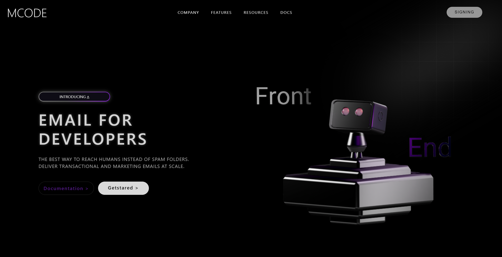

# 3DStartup 🚀

A 3D Startup project built with **HTML, CSS, and JavaScript**, featuring interactive 3D animations and a responsive design.

---

## Screenshot



---

## Features

- Interactive 3D animations
- Responsive and modern UI
- Works on all screen sizes
- Easy to navigate and explore

---

## How to View

Open `index.html` in your browser, or check out the live site on GitHub Pages:  
[Live Site](https://fsafiya187.github.io/3dstartup/)

---

## Technologies Used

- HTML5  
- CSS3 (Flexbox, Grid, Animations)  
- JavaScript (ES6)

---

## Installation (Optional)

1. Clone the repository:  
```bash
git clone https://github.com/fsafiya187/3dstartup.git
